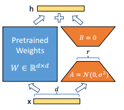

# 1 背景
1. ⼤模型通常包含数亿甚⾄数百亿个参数，对其进⾏微调需要⼤量的计算资源和存储空间。
2. 在微调过程中，直接修改预训练模型的所有参数可能会破坏模型的原始性能，参数更新会导致大模型的灾难性遗忘的问题。
3. 存储和部署微调后的⼤模型需要⼤量存储空间，尤其是当需要在多个应⽤场景中部署不同微调版本时。
4. 许多微调⽅法会增加推理阶段的计算延迟，影响模型的实时性应⽤。
   
# 2 LoRA（Low-Rank Adaptation)
LoRA（Low-Rank Adaptation) 通过引⼊低秩矩阵分解，在减少计算资源和存储需求的同时，保持了预训练模型的初始性能，稳定了微调过程，并降低了存储和部署成本。它特别适⽤于⼤规模模型的微调，在资源有限的环境中具有显著的优势。

# 3 LoRA优点
1. 存储与计算效率：通过低秩适应（LoRA），可以显著减少所需存储的参数数量，并减少计算需求。
2. 适应性与灵活性：LoRA⽅法允许模型通过只替换少量特定的矩阵A和B来快速适应新任务，显著提⾼任务切换的效率。
3. 训练与部署效率：LoRA的简单线性设计允许在不引⼊推理延迟的情况下，与冻结的权重结合使⽤，从⽽提⾼部署时的操作效率。
   
# 4 理解 LoRA
## 4.1 为什么需要低秩分解
1. 现代预训练模型虽然是过参数化的，但在微调时参数更新主要集中在⼀个低维⼦空间中。
2. 参数更新 $\Delta{W}$可以在低维度中进⾏优化，⾼维参数空间中的⼤部分参数在微调前后⼏乎没有变化。
3. 低秩分解使参数优化更⾼效，但如果参数更新实际上在⾼维⼦空间中发⽣，可能会导致重要信息遗漏和LoRA⽅法失效。

## 4.2 LoRA算法原理

$A$是⼀个随机初始化的矩阵，且服从正态分布
$B$初始化为零矩阵
(A,B可互换)
作⽤：这种初始化⽅法使得在训练初期，新增的部分$\Delta{W}$ 对原始权重$W$的影响为零，从⽽不会破坏预训练模型的初始性能
⽆需完全微调：LoRA⽅法允许在不累积对所有权重矩阵的全秩梯度更新的情况下，通过调整LoRA的秩来逼近原始模型的表达能⼒
⽆额外推理延迟：在⽣产中部署时，可以显式计算并存储，并像往常⼀样执⾏推理。这保证了与细调的模型相⽐，不会引⼊任何额外的延迟
秩$r<<d$，原来有$d*d$，现在只有$d*r+r*d$参数需要训练，减少了计算梯度所需的内存和浮点运算量（FLOPS）

为什么初始化参数使⽤正态分布：
1. 确保初始梯度的有效传播：正态分布初始化有助于在训练初期确保梯度有效传播，避免梯度消失或爆炸的问题
2. 提供⾜够的随机性：正态分布的随机初始化为模型提供了⾜够的随机性，从⽽能够探索更⼴泛的参数空间，增加了模型找到最优解的可能性
3. 平衡训练初期的影响：正态分布初始化的值⼀般较⼩，结合$B$初始化为零矩阵，可以在训练初期确保新增的偏置矩阵对原始预训练权重的影响为零，从⽽避免破坏预训练模型的初始性能
   
为什么 A初始化服从正态分布，⽽B初始化为零矩阵：
1. 如果B和A全部初始化为零矩阵，缺点是很容易导致梯度消失
2. 如果B和A全部正态分布初始化，那么在模型训练开始时，就会容易得到⼀个过⼤的偏移值，从⽽引起太多噪声，导致难以收敛
   
## 4.3 为什么 LoRA 在 Q, K, V, O 上有效
1. Self-Attention
Q（Query）矩阵：⽤于⽣成查询向量，决定模型在注意⼒机制中对输⼊的关注程度
K（Key）矩阵：⽤于⽣成键向量，与查询向量计算相似度，帮助确定注意⼒分布
V（Value）矩阵：⽤于⽣成数值向量，实际传递注意⼒机制计算的输出
O（Output）矩阵：⽤于将多头注意⼒的输出合并并映射回原始维度
2. Q, K, V, O在信息传播和特征表示中起着关键作⽤：
查询与键的交互：Q, K的交互决定了注意⼒分布，影响模型对输⼊序列的不同部分的关注度。
数值的加权求和：V矩阵通过加权求和操作，将注意⼒分布转化为具体的输出。
多头输出的整合：O矩阵整合多头注意⼒的输出，提供最终的特征表示。
3. LoRA 通过将权重矩阵分解为两个低秩矩阵,减少了参数数量，降低了计算和存储成本，同时保持模型性能：
参数压缩： Q, K, V, O矩阵通常包含⼤量参数，LoRA的低秩分解显著减少了需要优化的参数数量
性能保持：低秩矩阵能够捕捉到原始矩阵的主要信息，确保模型性能不受显著影响

## 4.4  LoRA中的最优秩的选择
1. LoRA 即使在⾮常⼩的秩下也展现出了竞争⼒的性能。
2. 在同时适配$W_{q}$和$W_{v}$时⽐仅适配$W_{q}$表现更好
3. 增加秩并没有覆盖更多有意义的⼦空间，说明低秩适配矩阵已⾜够
   
## 4.5 LoRA可以应⽤到模型中的哪些层
 线性层（全连接层），注意⼒层， 嵌⼊层
